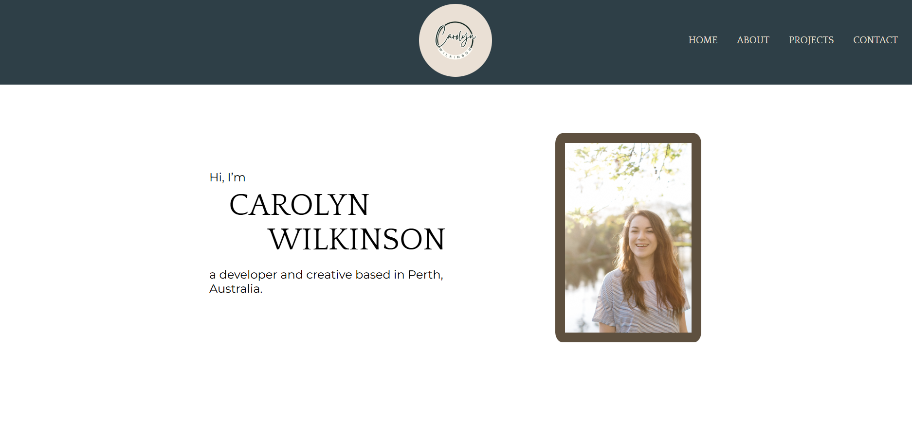
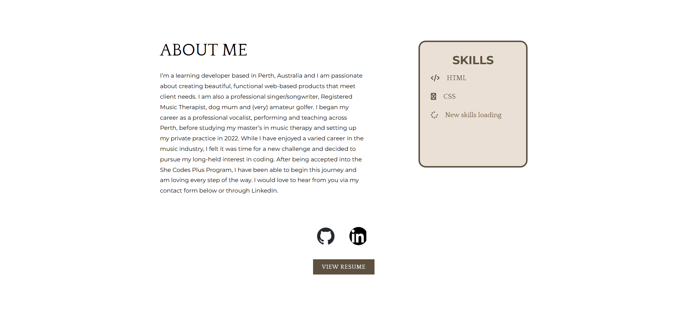
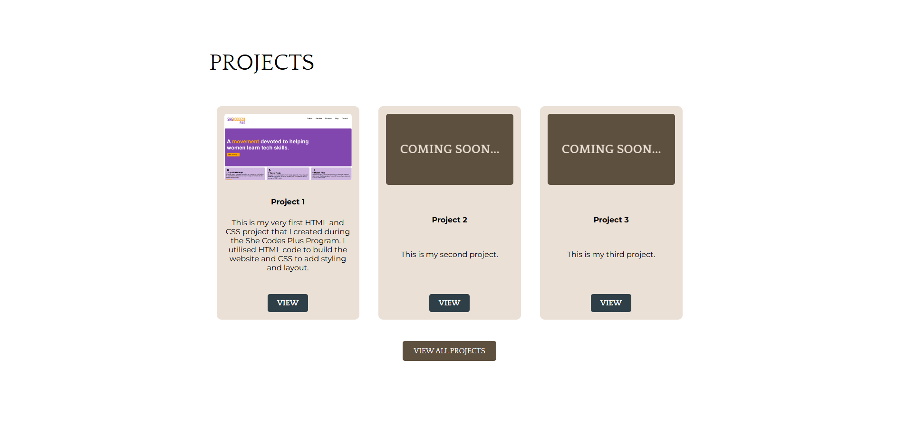
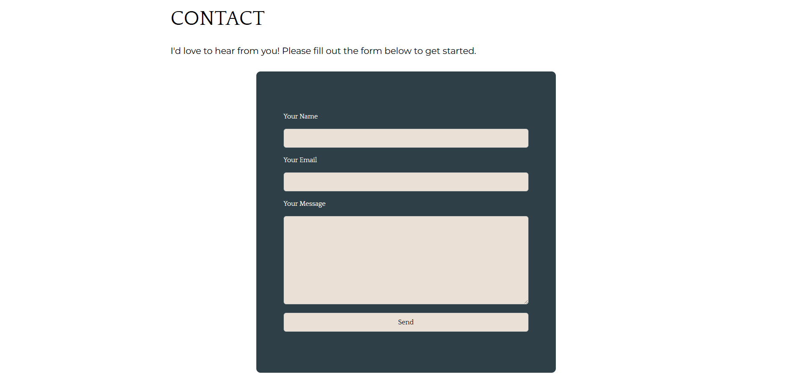
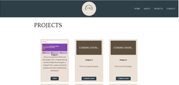
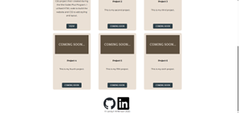
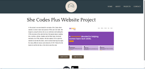

# CarolynWilkinson94.github.io

​
[Carolyn Wilkinson Portfolio Site] https://github.com/CarolynWilkinson94/CarolynWilkinson94.github.io
​
## Project Requirements

### Content
 Add a short paragraph describing the features below. What aesthetic and technical choices did you make? 

 I chose to include my profile picture in the top section of my home page, which is minimalist and includes a 'hero' section introducing me by name and with a short sentence about who I am. My biography is in my 'about' section, which is directly below my 'hero' as you scroll down. I wanted my 'hero' to be really minimalistic and clean, but with all my important info directly below, as most people would likely scroll down instinctively. I have then included a 'projects' overview, which has 3 article sections showing a picture and brief description of a few selected projects, with a button linked to a separate page for each project and a larger button below to link to another page that lists all of my projects. Below this is my contact form, which will send to my email. My 'about' section includes links to my resume, my Github and my LinkedIn, and I have the same Github and LinkedIn icons in the footer of each page. The most important information of my site is on the home page, with menu links that scroll down to each sectiion, and more in depth details of my projects are found on separate pages, which I thought kept the site looking clean, organised and easy to navigate. 

### Technical
 Add a short paragraph describing the features below. What strategies or design decisions did you work from? 

I decided to create 3 web pages, with the vision that there will be more in the future. The first is my home page with all the essential information about me and how to contact me, as well as previews of my projects. The second page is a menu of all my projects, with short descriptions and images of each project, and links to follow to an individual project page. The 3rd page is the individual project page of my first project, which has a larger image of the project, links to view the site and the code and a description of the project. As I complete more projects, more pages will be added. Throughout the process, I have saved different versions to Github, which was very helpful when I lost the code for my header and needed to restore it. I have done my best to implement responsive design principles and from my tests, it seems to work well. I have used semantic html, particularly the <header>, <footer> and <article> tags throughout my website. 
 

### Bonus (optional)
 Add a short paragraph describing the features below, if you included any. 

I managed to include some hover states in my menu and buttons, and while I did try to add a hamburger menu for mobile viewing, I wasn't able  to complete this in time and will continue to work on this as my website evolves with my projects. 
​
### Screenshots
> Please include the following:
> - The different pages and features of your website on mobile, tablet and desktop screen sizes (multiple screenshots per page and screen size).
> - The different features of your site, e.g. if you have hover states, take a screenshot that shows that.  
> 
> You can do this by saving the images in a folder in your repo, and including them in your readme document with the following Markdown code: 

Home page - hero section
(Screenshots/Screenshot 2025-06-22 150446.png)

About section
(Screenshots/Screenshot 2025-06-22 150458.png)(Screenshots/Screenshot 2025-06-22 150507.png)

Projects preview section
(Screenshots/Screenshot 2025-06-22 150514.png)(Screenshots/Screenshot 2025-06-22 150520.png)

Contact section
(Screenshots/Screenshot 2025-06-22 150527.png)

Projects menu page image 1
(Screenshots/Screenshot 2025-06-22 150544.png)

Projects menu page image 2
(Screenshots/Screenshot 2025-06-22 150551.png)

Individual project page
(Screenshots/Screenshot 2025-06-22 150602.png)(Screenshots/Screenshot 2025-06-22 150608.png)

Hover screenshot

